# FSM-Controlled Smart Football Event Detection ASIC

This repository documents an academic RTL-to-GDS-II ASIC design project for a deterministic, hardware-only smart football event detection system. The design processes accelerometer- and gyroscope-related inputs using sensor-event detection logic, a finite-state-machine controller, and top-level output gating.

The original project covers RTL design, functional verification, Yosys synthesis, OpenLane physical design, Sky130 implementation, DRC and LVS verification, and GDS-II generation.

## Project Overview

Smart football sensing can use motion inputs to detect events such as impacts, kicks, ball movement, and handling-related activity. This project explored a dedicated digital ASIC approach instead of a microcontroller or machine-learning pipeline.

The motivation for deterministic hardware logic was predictable latency, bounded execution time, interpretability, easier verification, and reduced software overhead. The report frames the design as a pure-hardware sensing pipeline where sensor-derived flags are evaluated by combinational logic and qualified by a compact FSM.

This repository is organized to distinguish clearly between:

- Original project results described in the final report.
- Original files currently available in this repository.
- Documentation-based reconstructed RTL created for educational reference.

The design was not fabricated in silicon, and the reported OpenLane flow did not achieve full timing closure.

## System Architecture

The report describes the architecture as a staged digital sensing pipeline:

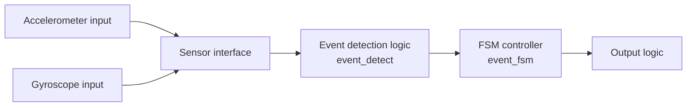

At a high level:

- Accelerometer input -> sensor interface -> event detection logic -> FSM controller -> output logic
- Gyroscope input -> sensor interface -> event detection logic -> FSM controller -> output logic

The sensor-event logic computes event flags, but `event_valid` does not simply follow raw sensor activity. The report describes it as a gated decision that becomes active only when the required sensor-event conditions are present and the FSM opens the proper detection window.

## RTL Modules

### event_detect

`event_detect` is the main computational block. The final report describes it as a deterministic sensor-event evaluator with the largest combinational network in the design.

Reported synthesis result:

- Approximately 10,915 cells

The report indicates that this block dominates logic complexity through Boolean comparison and reduction logic. The exact original Boolean equations and sensor preprocessing rules are not available in the attached source files, so this repository does not attempt to recreate the exact original implementation.

### event_fsm

`event_fsm` controls sequencing, manages the detection window, coordinates sampling and event qualification, and keeps the control path compact.

Reported synthesis result:

- 26 cells

The report shows a 3-bit FSM state sequence:

```text
000 -> 001 -> 010 -> 011 -> 000
```

### top

`top` integrates one `event_detect` instance and one `event_fsm` instance, along with sequencing logic, gating logic, and output formatting.

Reported top-level synthesis results:

- 185 cells
- 35 flip-flops

## How The System Works

The report describes the key sequencing signals as:

- `sample_tick`
- `sample_done`
- `process_done`
- `detect_en`
- `accel_event`
- `gyro_event`
- `event_valid`
- `fsm_state`

After reset deassertion, repeated `sample_tick` pulses establish sampling windows. `sample_done` and `process_done` follow as downstream handshake signals. The FSM progresses through:

```text
000 -> 001 -> 010 -> 011 -> 000
```

`detect_en` is asserted during the final qualification stage. `event_valid` asserts only when the sensor event conditions and the FSM detection window align.

## Functional Verification

The original project used waveform-based verification. The report shows:

- Reset deassertion.
- Repeated sampling windows.
- `sample_tick` pulses.
- Downstream `sample_done` and `process_done` signals.
- Sensor event flags.
- FSM state progression.
- `detect_en` during the qualification stage.
- `event_valid` asserting after the required timing and sensor conditions align.

### Full Functional Waveform

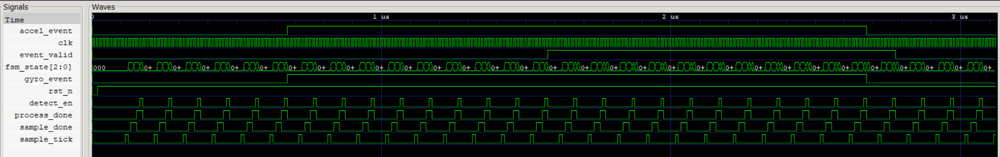

### Event Detection Interval

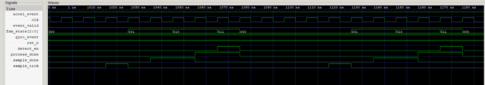

## ASIC Design Flow

The report describes the following open-source RTL-to-GDS-II flow:

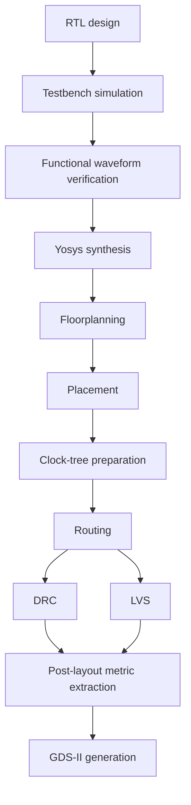

## Tools And Technologies

Confirmed by the final report:

- Verilog RTL
- Yosys
- OpenLane
- OpenROAD
- SkyWater SKY130 PDK
- Waveform-based simulation and verification
- GDS-II
- Digital ASIC flow
- Finite-state-machine design
- Physical design
- DRC
- LVS

## Synthesis Results

| Module | Reported result |
|---|---:|
| `event_detect` | 10,915 cells |
| `event_fsm` | 26 cells |
| `top` | 185 cells |
| Top-level flip-flops | 35 |

`event_detect` is the dominant computational block, while `event_fsm` contributes very little control overhead.

### Yosys Screenshots

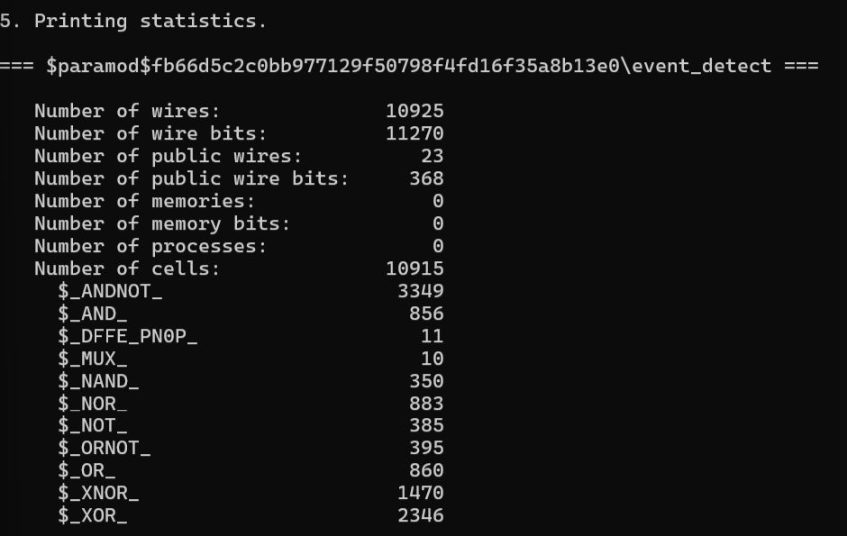

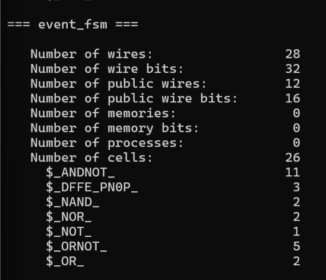

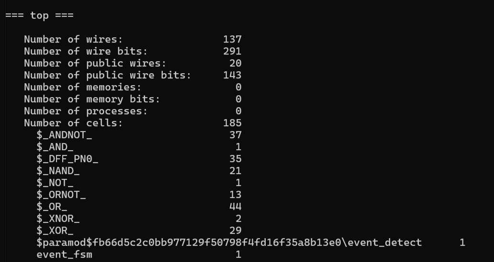

## Physical Design Results

| Metric | Value |
|---|---:|
| Die area | 0.2471 mm² |
| Core area | 229,900.49 µm² |
| Core utilization target | 40% |
| Achieved utilization | 41.18% |
| Synthesized cell count | 9,369 |
| Total physical cells | 29,936 |
| Wire length | 305,212 |
| Via count | 68,115 |
| Worst negative slack | -2.77 ns |
| Total negative slack | -23.61 ns |
| Critical path | 10.76 ns |
| Suggested clock period | 12.71 ns |
| Suggested frequency | 78.68 MHz |
| DRC violations | 0 |
| LVS errors | 0 |

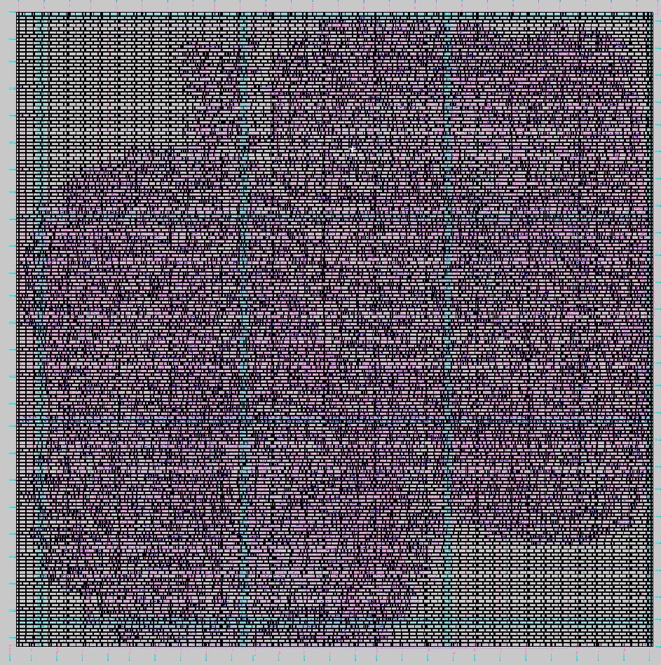

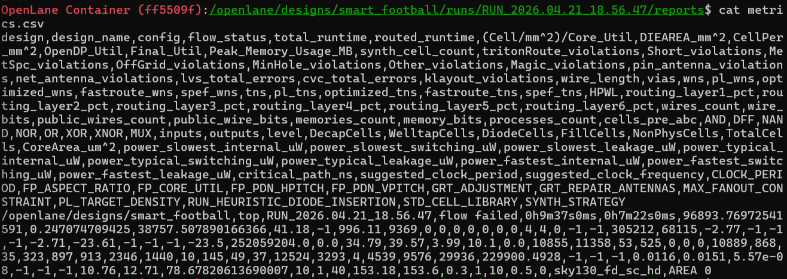

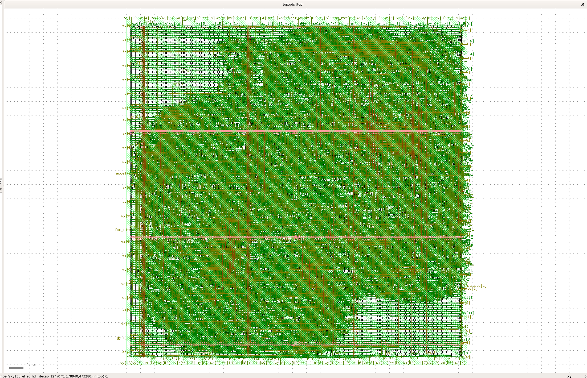

## Physical Verification

The report shows clean DRC and LVS results:

- DRC = 0 means no reported geometry-rule violations.
- LVS = 0 means no reported connectivity mismatch.
- The routed layout is physically consistent with the intended netlist.

However, the overall flow still reports failure because timing closure was not achieved. This should be read as a timing-performance issue rather than a DRC or LVS failure.

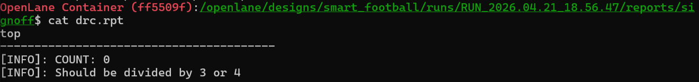

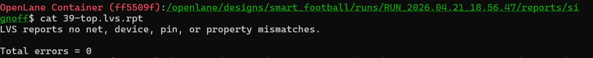

## Timing Status

The final report states:

- Worst negative slack is -2.77 ns.
- Total negative slack is -23.61 ns.
- Setup violations remain.
- The design is not fully timing-closed.
- The reported OpenLane run status is failed because of timing.

The DRC and LVS results are clean, so the unresolved issue is timing closure rather than physical-rule correctness or netlist-layout mismatch.

## Limitations

- Timing closure was not achieved.
- The `event_detect` block has a large combinational footprint.
- The original RTL source is not available in the attached files.
- The exact thresholds and sensor preprocessing rules are not recoverable from the documentation alone.
- The design was not validated on fabricated silicon.
- The report does not establish real-world sensor accuracy across a large football dataset.
- The reconstructed RTL in this repository is educational reference code and is not the original implementation.

## Future Improvements

Future work supported by the report includes:

- Pipeline long combinational paths.
- Reduce combinational logic depth.
- Balance Boolean trees.
- Buffer high-fanout nets.
- Improve placement and floorplan constraints.
- Retune density.
- Optimize timing.
- Support more football-specific event classes.
- Validate with real sensor traces.
- Eventually evaluate fabricated silicon.

## Repository Contents

| Path | Purpose |
|---|---|
| `docs/` | Original report and presentation attachment. |
| `assets/` | Extracted images from the final report. |
| `original-source/` | Placeholder for genuine original RTL, testbench, scripts, constraints, and layout artifacts if they are added later. |
| `reconstructed-rtl/` | Documentation-based educational Verilog reconstruction. |
| `openlane/` | Notes on the reported OpenLane flow. |
| `results/` | Summary of report-backed synthesis, physical design, DRC, LVS, and timing results. |

## Original Vs Reconstructed Files

The original report and presentation are included under `docs/`. The original RTL, OpenLane configuration, constraints, run scripts, netlists, DEF files, GDS files, and full run directories are not currently available.

The RTL under `reconstructed-rtl/` is a documentation-based reconstruction and is not the exact original RTL used to produce the synthesis and physical-design results in the final report.

## Documentation Links

- [Final report](docs/ASIC_FINAL_REPORT.pdf)
- [Keynote presentation](docs/ASIC_PRESENTATION.key)
- [Reconstructed RTL notes](reconstructed-rtl/README.md)
- [Original source notes](original-source/README.md)
- [OpenLane notes](openlane/README.md)
- [Results summary](results/README.md)

## Authors

- Ashka Pathak
- Farzan Bhalara

Completed as an academic project at Dhirubhai Ambani University.

## GitHub Topics

`asic` `verilog` `rtl-design` `digital-design` `finite-state-machine` `yosys` `openlane` `openroad` `sky130` `physical-design` `vlsi` `gdsii` `sensor-processing` `hardware-design`
