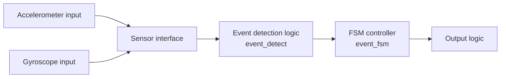
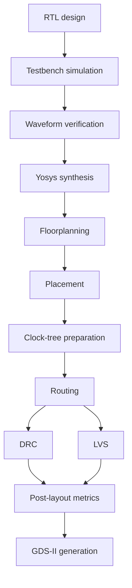

# FSM-Controlled Smart Football Event Detection ASIC

Most smart sports systems use software, firmware, or machine-learning models to make sense of sensor data. For this project, we wanted to explore a different question: how much of that decision-making can be moved directly into digital hardware?

We designed a small smart-football event detection ASIC that works with accelerometer- and gyroscope-related inputs. The design uses rule-based event detection logic and a compact finite-state machine (FSM) to decide when a motion event should be treated as valid.

This was a two-person academic project by Ashka Pathak and Farzan Bhalara at Dhirubhai Ambani University. The design was taken from RTL through synthesis and physical design using Yosys, OpenLane, OpenROAD, and the SkyWater SKY130 platform.

> **Important note**
>
> The original RTL and OpenLane run directory are not included in the available attachments. The Verilog under `reconstructed-rtl/` is a documentation-based reconstruction for understanding the design. It is not the exact RTL used to produce the synthesis and layout results in the final report.

## What We Wanted To Build

The idea was to detect football-related motion events using digital signals derived from an accelerometer and a gyroscope. Instead of sending the data to a processor and running software on it, we built a deterministic hardware path:

```text
sensor inputs -> event detector -> FSM controller -> valid event output
```

The goal was not to build a complete commercial sports tracker. The goal was to see whether a simple, hardware-only event detector could be designed, verified, synthesized, placed, routed, and checked using an open-source ASIC flow.

## Why Hardware-Only?

A microcontroller would have been easier to program, and a machine-learning model could support more flexible event detection. But both approaches add extra layers: instruction execution, scheduling, memory accesses, model inference, or firmware maintenance.

For this project, we chose fixed digital logic because it is easier to reason about. The circuit follows a defined sequence, the output timing is predictable, and the behavior can be checked directly in simulation. That made it a good fit for a student ASIC project where we wanted to understand the whole path from logic design to layout.

## How The Design Works

The system is split into three main RTL blocks:

| Module | Role |
|---|---|
| `event_detect` | Checks accelerometer and gyroscope conditions and produces event flags. |
| `event_fsm` | Controls when the system samples, processes, and accepts an event. |
| `top` | Connects the detector and FSM, then generates the final output signals. |

The report describes the architecture like this:



The main work happens inside the event detector. It checks the accelerometer and gyroscope conditions and decides whether they look like a possible football event. The FSM then decides whether the system is actually in the right part of its cycle to accept that event.

This distinction matters. `event_valid` does not simply turn on whenever the sensor flags are high. It only becomes active when the sensor conditions line up with the FSM's detection window.

## What The FSM Controls

The FSM is the timing part of the design. It decides when to sample the inputs, when processing is complete, and when the detector is allowed to qualify an event.

The report shows this FSM state sequence:

```text
000 -> 001 -> 010 -> 011 -> 000
```

The main signals are:

| Signal | What it means in the design |
|---|---|
| `sample_tick` | Starts a sampling window. |
| `sample_done` | Indicates that sampling has completed. |
| `process_done` | Indicates that internal processing has completed. |
| `detect_en` | Opens the final event qualification window. |
| `accel_event` | Event flag from accelerometer-related logic. |
| `gyro_event` | Event flag from gyroscope-related logic. |
| `event_valid` | Final qualified event output. |
| `fsm_state` | Exposes the current FSM state for debugging. |

In plain terms: the sensor flags can be true, but the FSM still has to say, "now is the correct time to count this as a valid event."

## Functional Verification

Before going into the ASIC flow, the design was tested with waveform-based simulation. The waveforms in the report show reset deassertion, repeated sampling windows, FSM state movement, event flags, `detect_en`, and the final `event_valid` output.

The full waveform gives a broad view of the repeated sampling behavior:


The zoomed waveform is more useful for understanding the timing. It shows the FSM moving through `000 -> 001 -> 010 -> 011 -> 000`, with `detect_en` appearing during the final qualification stage:


The key point from verification was that `event_valid` was not just a raw sensor pulse. It appeared only after the expected sequence of sampling, processing, and detection timing.

## From RTL To Layout

After functional verification, the design was taken through a standard digital ASIC flow:



The flow used:

- Verilog RTL
- Yosys
- OpenLane
- OpenROAD
- SkyWater SKY130 PDK
- Waveform-based simulation and verification
- DRC and LVS checks
- GDS-II generation

## What Happened During Synthesis

Synthesis showed that most of the logic was in the event detector, not the FSM. This made sense to us because the detector is the block doing the actual condition checking, while the FSM is mostly control logic.

| Module | Reported result |
|---|---:|
| `event_detect` | 10,915 cells |
| `event_fsm` | 26 cells |
| `top` | 185 cells |
| Top-level flip-flops | 35 |

The `event_detect` block was by far the largest part of the design. The FSM stayed very small, which was a good sign because the control logic was not adding much area overhead.


## Physical Design Results

OpenLane produced a routed layout for the design. The report includes layout views, signoff screenshots, and the final post-layout metrics.

| Metric | Value |
|---|---:|
| Die area | 0.2471 mm² |
| Core area | 229,900.49 µm² |
| Core utilization target | 40% |
| Achieved utilization | 41.18% |
| Synthesized cell count | 9,369 |
| Total physical cells | 29,936 |
| Wire length | 305,212 |
| Via count | 68,115 |
| Worst negative slack | -2.77 ns |
| Total negative slack | -23.61 ns |
| Critical path | 10.76 ns |
| Suggested clock period | 12.71 ns |
| Suggested frequency | 78.68 MHz |
| DRC violations | 0 |
| LVS errors | 0 |

The layout passed both DRC and LVS. DRC checks whether the geometry follows the manufacturing rules. LVS checks whether the layout still matches the intended circuit connectivity.


## What Worked

The design made it through the full RTL-to-GDS-II path described in the report. The main things that worked were:

- The RTL behavior was checked using simulation waveforms.
- The FSM sequence matched the expected multi-cycle flow.
- Yosys synthesis preserved the intended module structure.
- OpenLane produced a placed and routed layout.
- DRC reported 0 violations.
- LVS reported 0 errors.

These results were encouraging because they showed that the design was not just a block diagram or simulation exercise. It reached a physically checked layout.


## What Did Not Fully Work

The main limitation was timing.

The layout passed DRC and LVS, which means the geometry and connectivity were correct. The remaining issue was that some paths were still too slow for the target clock.

Reported timing status:

- Worst negative slack: -2.77 ns
- Total negative slack: -23.61 ns
- Setup violations remained
- The OpenLane flow status was failed because timing closure was not achieved

So this should not be described as a fully timing-closed chip. It is better to describe it as a routed and physically verified layout with unresolved timing violations.

## Other Limitations

- The design was not fabricated in silicon.
- The exact original RTL is not included in the available files.
- The exact sensor thresholds and preprocessing rules cannot be recovered from the documentation alone.
- The reconstructed RTL is only an educational reference.
- The report does not prove real-world sensor accuracy across a large football dataset.

## What We Would Improve Next

The part we would improve first is the `event_detect` block, because it was the largest and most timing-sensitive part of the design.

Possible next steps:

- Pipeline long combinational paths.
- Reduce the depth of large Boolean logic.
- Balance comparison and reduction logic.
- Add buffering for high-fanout nets.
- Improve floorplan and placement constraints.
- Retune density for better timing.
- Add more football-specific event classes.
- Test with real sensor traces.
- Eventually evaluate the design on fabricated silicon.

## Repository Contents

| Path | What it contains |
|---|---|
| `docs/` | Final report and Keynote presentation attachment. |
| `assets/` | Extracted images from the final report. |
| `original-source/` | Notes about missing original RTL, testbench, scripts, constraints, and layout artifacts. |
| `reconstructed-rtl/` | Documentation-based Verilog reconstruction for learning and review. |
| `openlane/` | Notes on the reported OpenLane flow and missing original configuration. |
| `results/` | Report-backed synthesis, layout, DRC, LVS, and timing summary. |

## Original Vs Reconstructed Files

The original report and presentation are included under `docs/`. The original RTL, OpenLane configuration, constraints, run scripts, netlists, DEF files, GDS files, and full run directories are not currently available.

The RTL under `reconstructed-rtl/` is a documentation-based reconstruction and is not the exact original RTL used to produce the synthesis and physical-design results in the final report.

## Documentation Links

- [Final report](docs/ASIC_FINAL_REPORT.pdf)
- [Keynote presentation](docs/ASIC_PRESENTATION.key)
- [Reconstructed RTL notes](reconstructed-rtl/README.md)
- [Original source notes](original-source/README.md)
- [OpenLane notes](openlane/README.md)
- [Results summary](results/README.md)

## Authors

- Ashka Pathak
- Farzan Bhalara

Completed as an academic project at Dhirubhai Ambani University.

## GitHub Topics

`asic` `verilog` `rtl-design` `digital-design` `finite-state-machine` `yosys` `openlane` `openroad` `sky130` `physical-design` `vlsi` `gdsii` `sensor-processing` `hardware-design`
